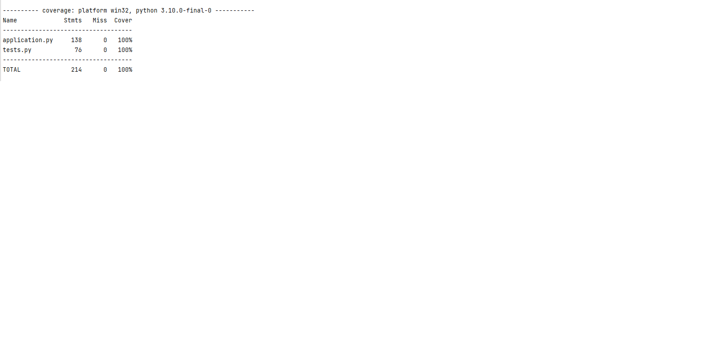

# Fundamentals Project
This is my project for the QA Academy Fundamentals assessment

## Installation
To install run deploy.sh

## Usage
The homepage contains a table that shows the rotas created.
 
It displays the employee id and shift id that link together to show which employee is on which shift.
 
You can create a new rota by selecting 'Create New Rota'
 
To view Shifts or Employees click 'View Shifts' or 'View Employees' respectively
 
In the shifts and employees page you can create, edit and delete records

## Testing

